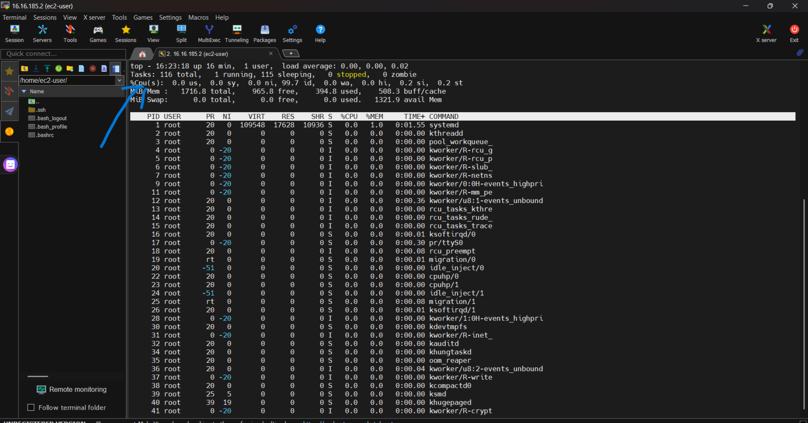

## How to apply a load balancer to instances in AWS ##
1. **Create a Target Group**:
   - Define the group of instances or IP addresses that the load balancer will route traffic to.
   - Configure health checks to monitor the status of targets.

2. **Launch EC2 Instances**:  on this hands-on i'm launching two instances
   - On the AWS management console, navigate to instance and click on launch instance
   

   - add your name and tag and number of instances
   

   - choose your AMI (AMASON MACHINE IMAGE)
    

   - Here i choose red hat as my AMI
    

   - Select your istance type, here i use t3 small
    

   - select your key pair, if you don't have create one,
   click to learn how to create
    

   -  select your security group, if you don't have create one,
   click to learn how to create,
   here my security group is launch-wizard-1 which allows inbound traffic from http and ssh
   

   - click on advance details and navigate to user data  then add your bootstrap text

   here i used
    "#!/bin/bash
   yum install httpd -y
   service httpd start
   chkconfig httpd on
   hostname > /var/www/html/index.html" as my user data which install a webserver, start it , configure it and serve the hostname 
   - click on launch instance and your two instances will be launched
   
   

3. **Set Up the Load Balancer**:
   - on the aws console navigae to load balancer and click on create load balancer
   

   - Choose the type of load balancer (e.g., Application Load Balancer for HTTP/HTTPS traffic).
   

   here i choosed a classic load balancer
   click on classic load balancer and click on create
   

   - Configure the load balancer with name, security groups, listeners, and routing rules. etc
     - select your name and scheme,
   for now your scheme should be internet facing
   

     - make sure it is available in all availability zone available
   

     - select your security group
  

   - set your advance health check settings
   

4. **Register Targets**:
   - Add your EC2 instances or IP addresses to the target group.
   

   set your timeout(draining interval) in the attribute
   

5. **add your tag and create your load balancer**

6.  **Test the Load Balancer**:
   - Access the DNS name of the load balancer to verify traffic distribution and health checks.
   by copying the DNS name and accessing it on the browser
   

   

   we can see the load balancer is now distributing traffic to the instances

# Integrating load balancers with an auto-scaling group ensures efficient distribution of traffic while dynamically scaling server instances based on demand. Here’s a step-by-step guide to implement this setup #
## Step-by-Step Method ##

1. ## create a launch template ##
- On the aws console navigate to launch template and click on lauch template

- put the launch template name and version

- input your tag

- select you AMI (Amason Machine Image)

- select your instance type and your key pair (create a new key pair if you don't have)

- select your security group (create if you don't have)

-  click on advance details and navigate to user data  then add your bootstrap text
 here i used

    "#!/bin/bash
   yum install httpd -y
   service httpd start
   chkconfig httpd on
   hostname > /var/www/html/index.html" as my user data which install a webserver, start it , configure it and serve the hostname 
   - click on launch templates to launch your template
   
2. **Set Up the Load Balancer**:
   - on the aws console navigae to load balancer and click on create load balancer
   

   - Choose the type of load balancer (e.g., Application Load Balancer for HTTP/HTTPS traffic).
   

   - here i choosed a classic load balancer
   click on classic load balancer and click on create
   

   - Configure the load balancer with name, security groups, listeners, and routing rules. etc
     - select your name and scheme,
   for now your scheme should be internet facing
   

     - make sure it is available in all availability zone available
   

     - select your security group
  

   - set your advance health check settings
   

   - set your timeout(draining interval) in the attribute
   

   - add your tag and create your load balancer**

3. ## Set Up Your Auto Scaling Group ##
- on the aws console, navigate to the autoscaling group and click on create auto scaling group
- add the name , launch template and the version

- select all availabilty zones available and click next

- attach your load balancer by selecting from classic load balancer

- turn on elastic load balancing health check and set your Health check grace period and click on next

- set your scaling limit and set your average CPU utilization and the time for your instance warm up and click next

- add your tags and click on next

- review and create auto scaling group

## CHECKING OR TRIGGERING THE AUTOSCALING ##
To check or trigger the auto scaling, we have to simulate the CPU utilization to be greater than 70% i.e we set the CPU utilization to be 70%,
 To do the we have to loging the instance on mobaxterm application (download if you dont have)
- on the mobaxterm homepage click on session and click on SSH

- copy your instance ip and paste it on remote host, write the username as ec2-user because all instance in the aws has ec2-user as the username, then select your private key and press ok

- your instance will be logged in your mobaxterm 

- type the top command to see the CPU utilization

- use this command to simulate the CPU usage
" sudo yum install https://dl.fedoraproject.org/pub/epel/9/Everything/x86_64/Packages/e/epel-release-9-9.el9.noarch.rpm -y

sudo yum install stress -y

sudo stress --cpu 80 "
- this is the first command it finds the location of the package

- second command install the package

- third command simulate the CPU to 80%

- use the "top" command to see the CPU usage

- navigate to the AWS console, other instances will be created after some minutes

-  Access the DNS name of the load balancer to verify traffic distribution and health checks.
   by copying the DNS name and accessing it on the browser
    

